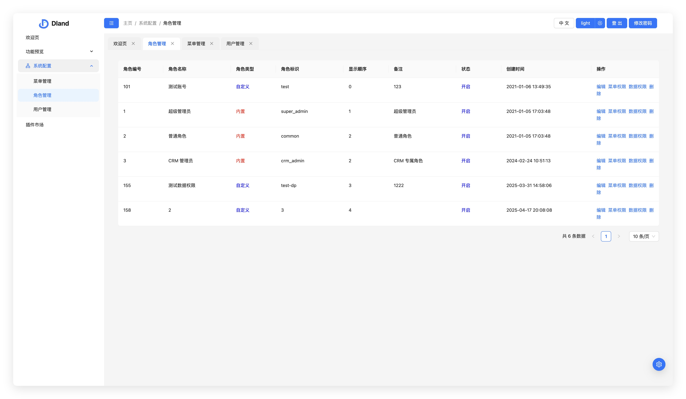

<p align="center">
    <a href="https://github.com/DLand-Team/moderate-react-admin">
    
    </a>
</p>

<h1 align="center">Moderate React Admin</h1>

<div align="center">

A modern enterprise-level frontend solution for admin panels, supporting multiple frameworks (Antd/Next.js/Shadcn UI/Tailwind CSS) and business plugins for an ultimate development experience.
<br />
Supports React 19 / 18, Next.js 15+, Shadcn UI, Ant Design 5+, Tailwind CSS 4.x, multi-platform adaptation, and embraces the latest ecosystem.

[](https://react.dev/)
[](https://nextjs.org/)
[](https://ui.shadcn.com/)
[](https://ant.design/)
[](https://tailwindcss.com/)
[](https://redux-toolkit.js.org/)
[](./LICENSE)
[](https://github.com/DLand-Team/moderate-react-admin/pulls)
</div>

---

[中文版 (Switch to Chinese)](./README.md)

---

## Resources

-   [Online Preview](http://111.229.110.163/)
-   [Documentation](https://dland-team.github.io/moderate-react-admin/)

## Core Features

-   🍎 **Seamless ruoyi-pro Integration**  
    Built-in dual token mechanism, user/role/menu management and other core features are integrated out of the box, no configuration required.

-   🍇 **True Business Layering**  
    Clear code separation, business logic decoupled from UI, easy to maintain and extend.

-   🥥 **Perfect NextJS Adaptation**  
    Supports keepalive in App mode, built-in Tab window for better multitasking experience.

-   🥕 **Business Plugin Architecture**  
    Business capabilities are pluggable, supporting component, Provider, router, i18n and more, enabling true reuse and accumulation.

-   🍞 **Enhanced Routing System**  
    Supports KeepAlive and multi-tab, with useActive hook for reliable state listening.

-   🥦 **Node.js Empowered Development**  
    Supports convention-based routing, visual generation of routes and state stores, greatly improving development efficiency.

-   🥑 **Ultimate State Management**  
    Deep Redux integration, simple syntax, zero learning curve, friendly type hints, easy to maintain.

## Tech Stack

-   React 18 / React 19
-   Ant Design 5 / Shadcn
-   Redux
-   React Router
-   Rsbuild / Vite
-   TypeScript

## Component Library Support Matrix

| Library      | NextJs | Pure Frontend | Scenario         | Recommendation                                              |
| ------------ | ------ | ------------ | ---------------- | ----------------------------------------------------------- |
| Antd         | ☑️     | ✅           | Comprehensive     | One-stop solution, worry-free, covers most scenarios.       |
| Material UI  | ☑️     | ☑️           | Customizable     | Best for high visual/function customization, for advanced devs. |
| Shadcn UI    | ✅     | ☑️           | Lightweight/Flexible | For those who want ultimate customization and lightweight projects, quick start, community-driven. |

### Shadcn-NextJs UI Preview

|  |  |
| :------------------------------: | :-----------------------------: |

## ruoyi-pro Core Features

### User Management


### Role Management



### Menu Management


### Code Generation


## Quick Start

### Frontend

```bash
# Install dependencies
pnpm i

# Start service
pnpm run start
```

### Backend

For local development, it is recommended to set up your own ruoyi server for API integration.
If you just want to try it out, the project is pre-configured to connect to my test server, no extra setup needed.

## Project Structure

This project uses turborepo to manage a monorepo, with a clear structure for easy extension and maintenance:

-   `apps/`: Main app directory, all frontend projects (e.g. admin-antd, admin-shadcn-nextjs) are here.
-   `packages/`: Shared libraries and tools, including dev-server, UI library, eslint/ts config, docs, etc.
-   `frontend/`: Frontend-related code. If backend is added in the future, a `backend/` directory will be created.
-   `_assets/`: Images and assets for documentation.

### Local Development

1. Install dependencies (in project root):
    ```bash
    pnpm install
    ```
2. Start a frontend project (e.g. admin-antd):
    ```bash
    pnpm --filter admin-antd dev
    ```
    Or enter `apps/admin-antd` and run:
    ```bash
    pnpm run dev
    ```
3. For other apps or packages, see their respective README files.

---

## Community

Welcome to join the "Idle D Island 🏝️" tech group! Here you'll find engineers from top companies, indie developers, outsourcing teams, and friendly folks. The atmosphere is pure, tech discussions are active, and you're warmly invited!

-   **Idle D Island Group 1** (500+ members): 551406017
-   **Idle D Island Group 2**: 1002504812

---
