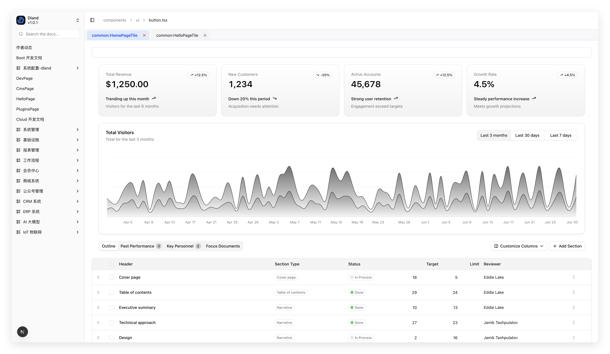
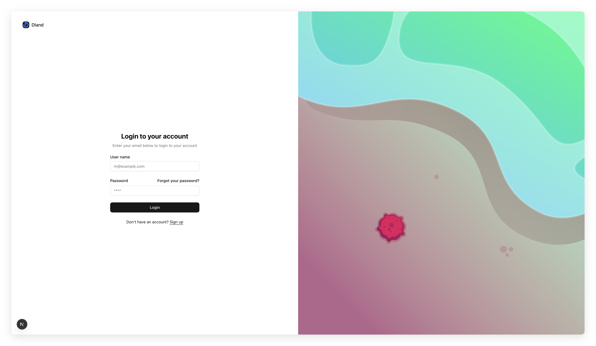
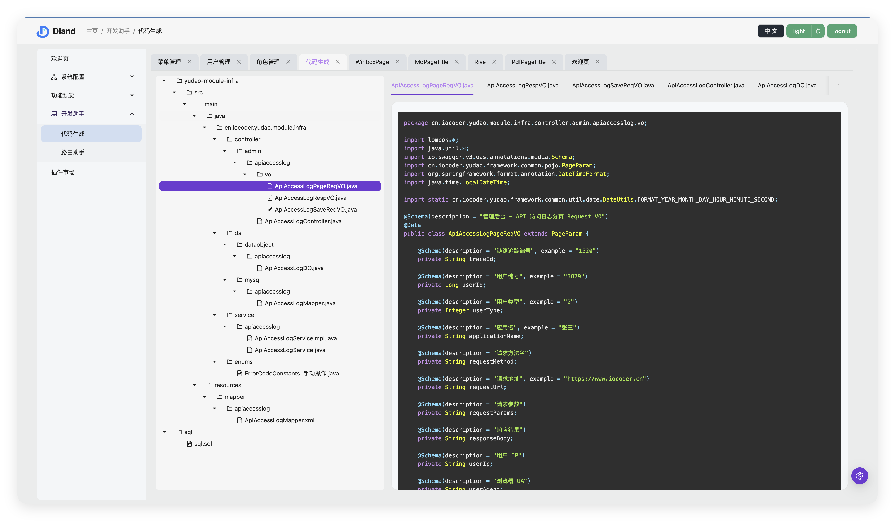

# Moderate


---

[中文说明 (Switch to Chinese)](./README.zh-CN.md)

---

## Resource Links

-   [Live Preview](http://111.229.110.163/)
-   [Documentation](https://dland-team.github.io/moderate-react-admin/)

## Core Features

-   🍎 **Seamless ruoyi-pro Integration**  
    Out-of-the-box support for dual token authentication, user/role/menu management, and more—fully compatible with ruoyi-pro backend.

-   🍇 **True Business Layering**  
    Code is clearly separated by business and UI logic, making the structure easy to maintain and extend.

-   🥥 **NextJS Support**  
    App mode keepalive and tab window support for multi-tasking scenarios.

-   🥕 **Business Plugin System**  
    Business logic can be modularized as components, providers, routes, i18n, etc. Plug and play—easy to reuse and iterate.

-   🍞 **Enhanced Routing**  
    Supports KeepAlive, tabbed browsing, and provides a reliable useActive hook for active route tracking.

-   🥦 **Node.js Empowered Development**  
    Convention-based routing, visual code generation for routes and state stores, boosting productivity.

-   🥑 **Best-in-class State Management**  
    Deep Redux integration, friendly type hints, super easy to use—no documentation needed.

## Tech Stack

-   React 18
-   Ant Design 5
-   Redux
-   React Router 6.4.3
-   Rsbuild or Vite
-   TypeScript

## UI Library Matrix

| UI Library  | NextJs | Pure Frontend | Scenario      | Strategy                                                                                              |
| ----------- | ------ | ------------- | ------------- | ----------------------------------------------------------------------------------------------------- |
| Antd        | ☑️     | ✅            | Full-featured | All-in-one, robust, recommended for most use-cases and developers.                                    |
| Material UI | ☑️     | ☑️            | Customizable  | Ideal for advanced developers with strong customization needs (visuals or logic).                     |
| Shadcn UI   | ✅     | ☑️            | Lightweight   | Great for rapid prototyping and high customization, best for those who integrate community resources. |

### Shadcn-NextJs Version Interface Preview

|  |  |
| :------------------------------: | :-----------------------------: |

## Integrated ruoyi-pro Features

### User Management


### Role Management


### Menu Management


### Code Generation



## Getting Started

### Frontend

```bash
# Step 1: Install dependencies
pnpm i

# Step 2: Start the project
pnpm run start
```

### Backend

For local development, it is recommended to run your own ruoyi backend.
However, for quick experience, the repo is pre-configured with a test server—no extra setup required.

## Project Structure

This project uses turborepo for monorepo management, making the codebase clear and extensible:

-   `apps/`: Main application directory (e.g. admin-antd, admin-shadcn-nextjs).
-   `packages/`: Shared libraries and tools, including dev-server, UI kits, eslint/ts configs, docs, etc.
-   `frontend/`: Frontend code (backend to be added in the future as `backend/`).
-   `_assets/`: Documentation assets.

### Running Locally

1. Install dependencies (run at root):
    ```bash
    pnpm install
    ```
2. Start a frontend app (e.g. admin-antd):
    ```bash
    pnpm --filter admin-antd dev
    ```
    Or inside `apps/admin-antd`:
    ```bash
    pnpm run dev
    ```
3. For other apps/packages, see their individual README files.

---

## Community

Join our “Leisure Island 🏝️” tech group chat!  
We have engineers from top companies, indie devs, agencies, and friendly folks.  
Clean, active, and technical atmosphere—everyone is welcome!

-   **Leisure Island 1 (500+ people):** 551406017
-   **Leisure Island 2:** 1002504812

---
