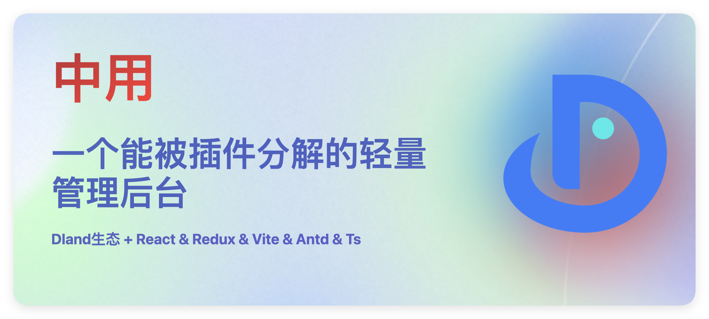
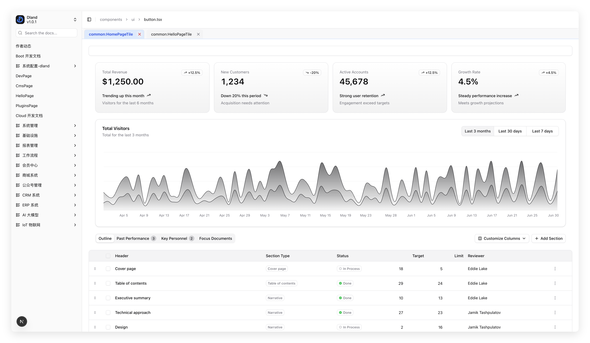
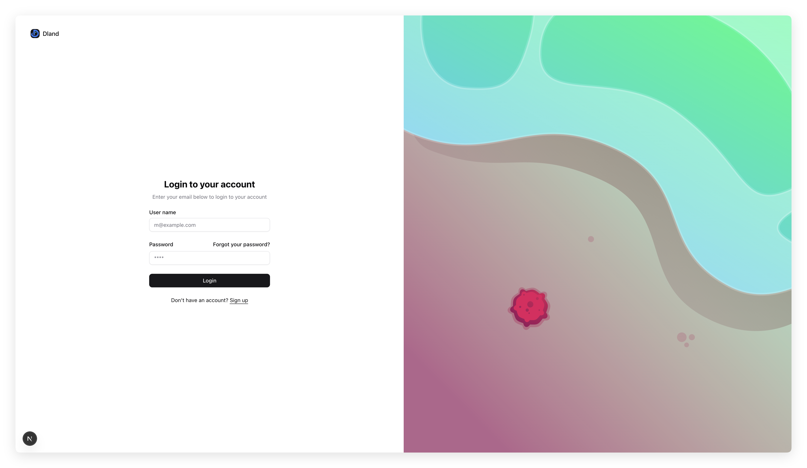
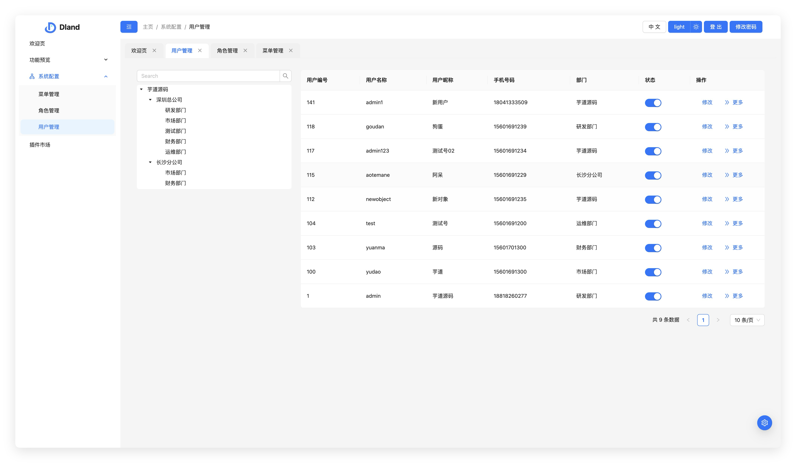
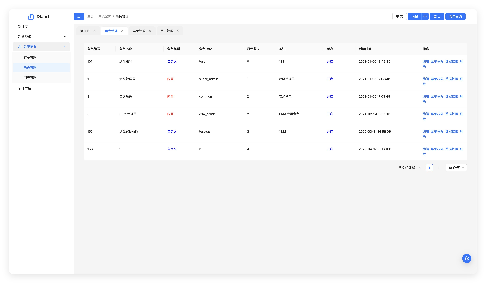
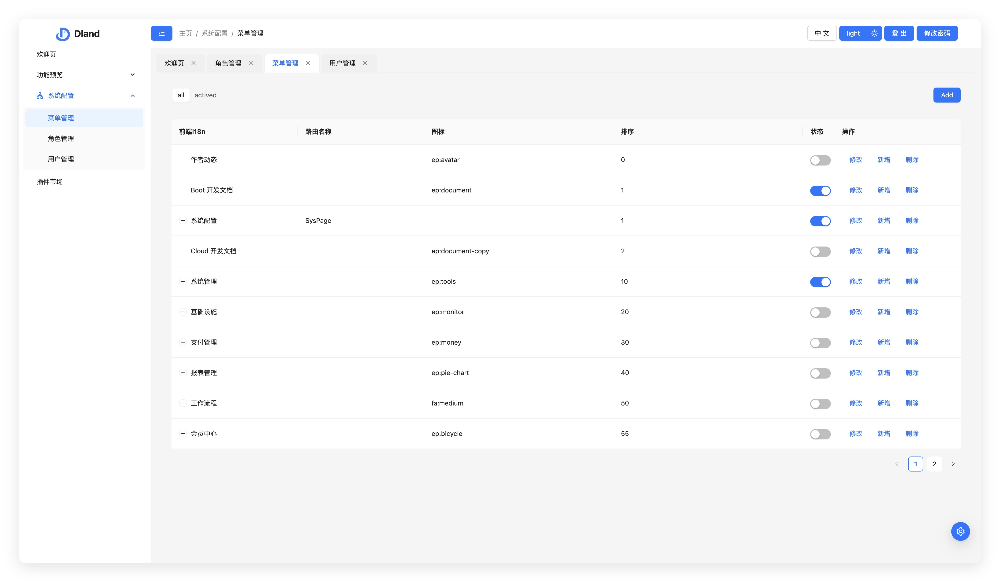
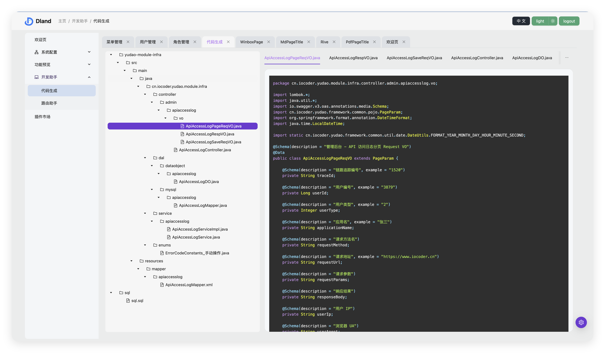

# Moderate



## 资源地址

[预览地址](http://111.229.110.163/)

[文档地址](https://dland-team.github.io/moderate-react-admin/)

## 核心特点

-   🍎 **无缝对接 ruoyi-pro 项目**，双 token 请求，用户管理，角色管理，菜单管理等核心功能已经原汁原味的对接了，开箱即用

-   🍇 **业务是”真“分层的**，就算搬砖也是讲究的，套路清晰，维护容易（放眼望去，能做到业务和 UI 分离的真没几个）

-   🥥 **NextJS配套**，支持App模式的keepalive，配套Tab窗口

-   🥕 **业务插件化**，能够有效的将业务拆分出来，组成包括但不限于组件，provider，路由，i18n等，即用即插，不用就卸，真正意义实现了“沉淀”的目标，方便复用和迭代

-   🍞 **强化的路由系统**，支持 KeepAlive 和 Tab 栏窗口，且具备useActive这一监听hook的才是”真靠谱“

-   🥦 **Nodejs 开发赋能**，支持约定式路由，可视化生成业务代码，如路由，状态仓库等

-   🥑 **最好用的状态管理方案**，整合 Redux 生态，大大简化使用难度，增强类型提示，无需翻阅文档，一眼就懂。（能秒 zustand 这些，我觉得～）

## 搭建情况

| 组件库      | NextJs | 纯前端 | 特点      | 使用策略                                                                                     |
| ----------- | ------ | ------ | --------- | -------------------------------------------------------------------------------------------- |
| Antd        | ☑️     | ✅     | 大全·僵硬 | 一把梭，省心省事，功能强大，定制化需求不多，适用大多数场景和开发者。                         |
| Material UI | ☑️     | ☑️     | 强大·繁琐 | 定制化需求比较多的场景，无论是视觉还是功能，都需要深入自定义，适合能力强且经验丰富的开发者。 |
| Shadcn UI   | ✅     | ☑️     | 轻巧·单薄 | 简洁轻量化搭建项目，可满足强烈的自定义需求，兼顾快速启动项目，适合能整合社区资源的开发者。   |


### Shacn-NextJs版本


|  |  |
|:-------------:|:-------------:|

## 接入 ruoyi-pro 的核心功能

### 用户管理



### 角色管理



### 菜单管理



### 代码生成



## 技术选型

-   React18
-   Antd5
-   Redux
-   React-router 6.4.3
-   Rsbuild 或 Vite
-   Ts

## 启动

### 前端

```shell
第一步
pnpm i

第二步
pnpm run start
```

### 后端

推荐本地开发自行跑起来一个芋道 ruoyi 项目，对接即可

懒得搞 Java？想快速跑起来看效果？好好好。

我已经在我的测试服务器部署了一个芋道 ruoyi 项目，项目中默认就是接入这个地址，方便各位道友快速上手。

## 社区

欢迎来 闲 D 岛 🏝️ 技术交流，纯绿色无公害，有大厂，有独立开发者，有外包，有红颜，欢迎加入～

**闲 D 岛**1️⃣（人数：500+）：551406017

**闲 D 岛**2️⃣：1002504812
